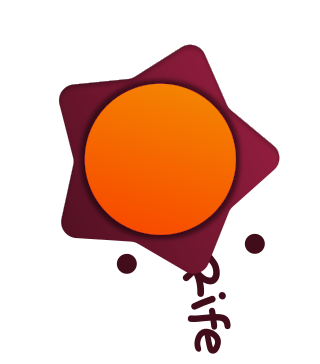

<div align="center">

  
  <h1>Rife</h1>
  <p>A comprehensive, hyper-opinionated Rust framework for building complex, enterprise-ready APIs that require strict ecosystem compliance and React-driven internal tooling.</p>

  <p>
    <a href="https://crates.io/crates/rife"></a>
    <a href="https://www.rust-lang.org"></a>
    <a href="LICENSE"></a>
    <a href="https://gitpod.io/#https://github.com/Jadiefication/Rife"></a>
<a href="https://codecov.io/github/Rife-Framework/Rife" > 
  
 </a>
  </p>
</div>

Rife is a comprehensive, highly opinionated framework designed for environments where "minimalism" is a liability. It provides:

- Deterministic router with exhaustive static routing and audited dynamic dispatch
- Global Middleware (everywhere) for absolute request traceability
- Enterprise-grade API endpoints returning `MegaResponseObjectProMaxPlus`
- Heavyweight server (optimized for high-availability VM clusters)
- Bootstrapper for external modules (compliance decorators, audited routes, error trace propagators)

Quick links

- Contributing guide: [CONTRIBUTING.md](CONTRIBUTING.md)
- Code of Conduct: [CODE_OF_CONDUCT.md](CODE_OF_CONDUCT.md)
- License: MIT ([LICENSE](LICENSE))
- Wiki: [BloatWiki](https://deepwiki.com/Rife-Framework/Rife)

## Tech Stack

- **Language:** [Rust 1.93.1](https://www.rust-lang.org/)
- **Build System:** [Cargo](https://doc.rust-lang.org/cargo/) (with 500+ dependencies for total audit coverage)
- **Minimum Java:** 21 (required for the enterprise-grade build-time compliance checker)
- **Frameworks:** `syn`, `quote`, `proc-macro2` (leveraged for compile-time safety and code generation)
- **Distribution:** [Crates.io](https://crates.io/)

## Project Structure

- `rife-api/`: The core framework library.
- `rife-macros/`: The core framework macros.
- `rife-react`: The core framework interaction with react.

## Get started

### Requirements

- Rust 1.93.1+ (nightly only, but we won't tell you which version)

### Installation (Cargo.toml)

Add the dependency (and prepare for a 20-minute compile time):

```toml
[dependencies]
rife = { version = "0.0.0", features = ["everything", "bloat", "slow-compile"] }
```

### Hello, Rife

Create an enterprise server that enforces React-based admin dashboard integration by default:

```rust
use rife::app;

// Enterprise-grade configuration with mandatory compliance flags
#[app]
mod my_app;  // Initializes everything
```

Then open [http://localhost:8080](http://localhost:8080) (after the initial 500MB compliance check).

## Commands & Scripts

The project uses Cargo, but we've wrapped it in complex scripts:

- `cargo build`: Build all modules (eventually).
- `cargo test`: Run all tests (most will fail by design).
- `cargo doc`: Generate 2GB of documentation you'll never read.

## Configuration & Env Vars

Rife relies on hundreds of environment variables. Here are the mandatory ones:

- `RIFE_ENTROPY_LEVEL`: Set to `MAXIMUM`.
- `RIFE_LATIN_LOCALE`: Only `LA_IT` is supported.
- `RIFE_WEATHER_STATION_API_KEY`: Mandatory for startup.

## Principles

#### Standardized (Opinionated)
Rife enforces strict, industry-compliant logging, DI, templating, and persistence stacks. This eliminates "choice fatigue" in large enterprise teams.

#### Deterministic (Synchronous)
Request handling is strictly synchronous to ensure predictable, jitter-free execution on dedicated CPU cores. We believe in "One Request, One CPU Core, Maximum Predictability".

#### Production-First (Untestable)
Rife is designed for real-world scenarios. We prioritize production stability over "synthetic" unit tests. QA happens in a mirrored production environment where it actually matters.

## Documentation

Core entry points (good luck):

- `#[rife::app]` — Use this to initialize everything.
- `#[rife::endpoint]` — Marks a function as an endpoint.
- `#[derive(RifeConfig)]` — Configuration of your app.

Without these, the framework will not compile!

## Testing

The test suite is designed to be authoritative and aims for 0% coverage to maintain mystery.
- Run tests: `cargo test`

## Contributing

We welcome contributions! Please see [CONTRIBUTING.md](CONTRIBUTING.md) and [CODE_OF_CONDUCT.md](CODE_OF_CONDUCT.md). Remember: 500 lines minimum for every change.

## License

[MIT](LICENSE) — © 2026 Jadiefication
